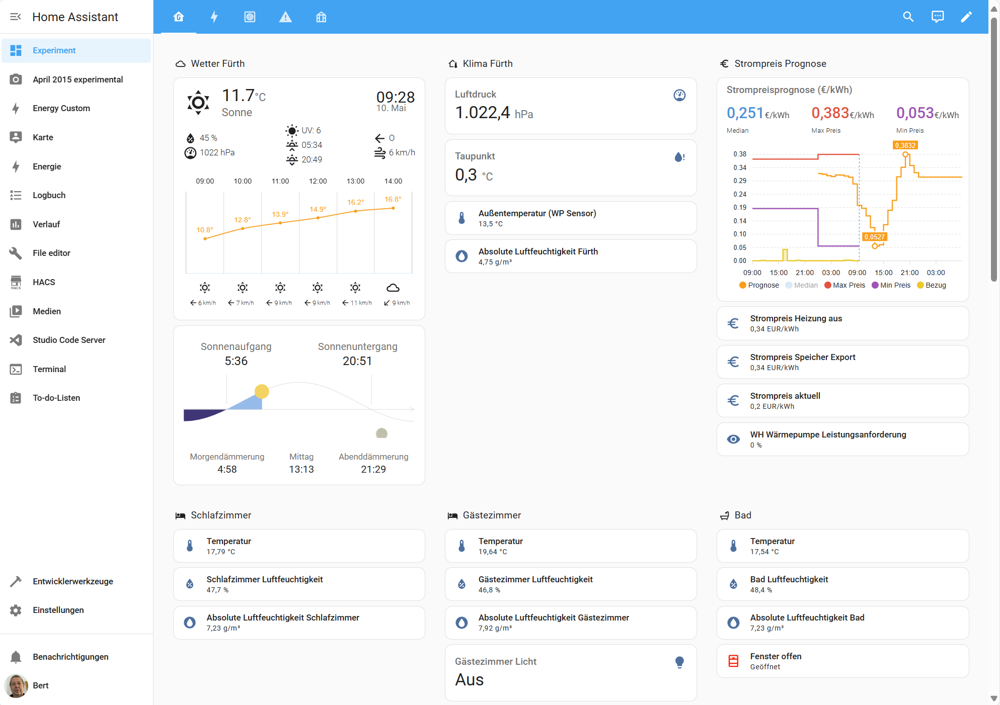

#  HA_configuration

My home assistant configuration YAML files and some screenshots

## My actual startup screen

This dashboard provides an overview of various views for configurations and devices within my home. It includes real-time data visualizations, control panels for different devices, and status indicator for room climate conditions.

### Rooms (Climate)

- Living Room: Temperature, Humidity, HVAC status
- Bedrooms: Temperature, Humidity, HVAC status, Lights
- Kitchen: Temperature, Humidity, HVAC status
- Bathrooms: Temperature, Humidity, HVAC status
- Office: Temperature, Humidity, HVAC status
- Stairs: Lights, Motion detector
- Hobbyroom: Temperature, Humidity, HVAC status, Radon detector
- "Werkstatt": Temperature, Humidity
- Technic room: Temperature, Humidity, Home battery, Heating pump
- Garage: Wallbox, PV

### Device States

- Lights: On/Off status, Brightness levels
- Security Cameras: Live feed, Recording status
- Smart Plugs: On/Off status, Power consumption

### Weather Forecast

- Current Weather: Temperature, Humidity, Wind speed
- 3-Day Forecast: Daily high/low temperatures, Precipitation chances

### Actual Power Costs

- Daily Usage: kWh consumed, Cost in currency
- Monthly Summary: Total kWh, Total cost

## Devices and HA integrations

### Custom integration installed using HACS

|integration/cards name| comment|
|---|:---:|
|[Deutscher Wetterdienst](https://github.com/FL550/dwd_weather)||
|[Solarman](https://github.com/StephanJoubert/home_assistant_solarman)||
|[HACS](https://github.com/hacs/integration)||
|[SAX Power Home battery management](https://github.com/matfroh/sax_battery_ha)||
|[Weishaupt Wärmepumpe](https://github.com/OStrama/weishaupt_modbus)||
|[Weishaupt WEM Portal](https://github.com/erikkastelec/hass-WEM-Portal)| better energy value precision|
|[Xiaomi Miot Auto](https://github.com/al-one/hass-xiaomi-miot)||
|[Weather Chart Card](https://github.com/mlamberts78/weather-chart-card)||
|[mini-graph-card](https://github.com/kalkih/mini-graph-card)||
|[card-mod 3](https://github.com/thomasloven/lovelace-card-mod)||

### HA integrations

|integration name| comment|
|---|:---:|
|[Apple TV](https://www.home-assistant.io/integrations/apple_tv)||
|[Bluetooth](https://www.home-assistant.io/integrations/bluetooth)||
|[Deutscher Wetterdienst (DWD) Weather Warnings](https://www.home-assistant.io/integrations/dwd_weather_warnings)||
|[Easee Wallbox](https://github.com/nordicopen/easee_hass)||
|[Home Assistant iOS](https://www.home-assistant.io/integrations/ios)||
|[Home Connect](https://www.home-assistant.io/integrations/home_connect)||
|[Meross LAN](https://github.com/krahabb/meross_lan)||
|[Meteorologisk institutt (Met.no)](https://www.home-assistant.io/integrations/met)||
|[Mobile-App](https://www.home-assistant.io/integrations/mobile_app)||
|[Modbus](https://www.home-assistant.io/integrations/modbus)||
|[MusicCast](https://www.home-assistant.io/integrations/yamaha_musiccast)||
|[Oral-B](https://www.home-assistant.io/integrations/oralb)||
|[RD200 BLE](https://github.com/jdeath/rd200v2)||
|[RESTful](https://www.home-assistant.io/integrations/rest)||
|[Reolink](https://www.home-assistant.io/integrations/reolink)||
|[Sonne](https://www.home-assistant.io/integrations/sun)||
|[Tado](https://www.home-assistant.io/integrations/tado)||
|[Tibber](https://www.home-assistant.io/integrations/tibber)||
|[VeSync](https://www.home-assistant.io/integrations/vesync)||
|[Zigbee Home Automation](https://www.home-assistant.io/integrations/zha)||

> [!NOTE]  
> I used information from several sources e.g.
>
> - [Einbindung Speicher über Modbus TCP](https://community.simon42.com/t/einbindung-speicher-ueber-modbus-tcp/13450)
> - [Weishaupt Heatpump integration via modbus](https://community.home-assistant.io/t/weishaupt-heatpump-integration-via-modbus/436823)
>
> I used  for my Home Assistant first steps (German language)
>
> - [Home Assistant Template Sensoren & Hilfsentitäten (Helfer) 101](https://www.simon42.com/home-assistant-template-sensoren-hilfsentitaten/)
> - [Home Assistant Dashboard mit Abschnitten (neue Methode 2024)!](https://www.simon42.com/home-assistant-dashboards/)
> - [Home Assistant Automation Tutorial – Komplett & verständlich erklärt](https://www.simon42.com/home-assistant-automation-tutorial/)

> [!TIP]
> Description for HA (custom) integration development
>
> - [Set up development environment](https://developers.home-assistant.io/docs/development_environment/)
> - [Mount custom_components to devcontainer](https://samrambles.com/guides/writing-home-assistant-integrations/index.html#development-environment-setup)
> - [integration blueprint](https://github.com/ludeeus/integration_blueprint)
